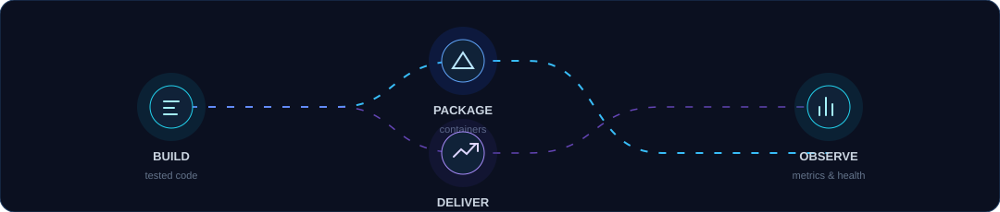

<!-- Profile README for github.com/iconamine. Motion is progressive enhancement. -->

  

<a href="mailto:ajanamine@gmail.com">Email</a>&nbsp;&nbsp;·&nbsp;&nbsp;<a href="https://www.linkedin.com/in/amine-ajana-3a78a0376/">LinkedIn</a>&nbsp;&nbsp;·&nbsp;&nbsp;<a href="https://github.com/iconamine?tab=repositories">Repositories</a>

## 01 / Profile

Final-year Information Systems Engineering student at EMSI, with hands-on experience across Deloitte, VISEO and Banque Centrale Populaire. I work where operational needs meet dependable systems: translating requirements into testable delivery, building data products that can be run and observed, and designing workflows that make decisions traceable.

My public work is deliberately production-minded: containers, tested APIs, deployment manifests, CI, data-quality controls and operational dashboards. I am growing toward cloud infrastructure and platform-engineering roles where reliability, automation and clear operating models matter.

  

## 02 / Engineering domains

| Domain | What I work on |
| :-- | :-- |
| **Cloud-native delivery** | Containerised services, Kubernetes manifests, repeatable local environments and CI workflows. |
| **Data systems** | Event contracts, quality controls, API services, orchestration and decision-ready analytics. |
| **CRM & service operations** | Requirements, acceptance criteria, UAT, defect traceability and operational control towers. |
| **Observability** | Application metrics, health signals and operational views with Prometheus and Grafana. |

## 03 / Technical ecosystem

<table>
  <tr>
    <td valign="top" width="50%">
      <strong>PLATFORM &amp; DELIVERY</strong>  
      <code>Docker</code> &nbsp; <code>Kubernetes</code> &nbsp; <code>GitHub Actions</code> &nbsp; <code>Git</code>
    </td>
    <td valign="top" width="50%">
      <strong>BACKEND &amp; DATA</strong>  
      <code>Python</code> &nbsp; <code>FastAPI</code> &nbsp; <code>SQL</code> &nbsp; <code>PostgreSQL</code> &nbsp; <code>Redis</code>
    </td>
  </tr>
  <tr>
    <td valign="top">
      <strong>EVENTS &amp; ORCHESTRATION</strong>  
      <code>Kafka / Redpanda</code> &nbsp; <code>dbt</code> &nbsp; <code>Airflow</code> &nbsp; <code>YAML</code>
    </td>
    <td valign="top">
      <strong>OBSERVABILITY &amp; QUALITY</strong>  
      <code>Prometheus</code> &nbsp; <code>Grafana</code> &nbsp; <code>pytest</code> &nbsp; <code>mypy</code>
    </td>
  </tr>
</table>

  

## 04 / Current focus

- Strengthening cloud-native operational patterns: container packaging, Kubernetes deployment design and observable services.
- Building systems with clear contracts, reproducible environments and intentionally scoped failure modes.
- Deepening platform-engineering foundations for infrastructure, automation and resilient delivery work.

## 05 / Selected systems

<table>
  <tr>
    <td width="50%" valign="top">
      <h3><a href="https://github.com/iconamine/datatrust-360">DataTrust 360</a></h3>
      
Observable transaction-risk and data-quality platform built around streaming, trusted data products and explainable decisions.

      
<code>Python</code> <code>FastAPI</code> <code>Kafka</code> <code>PostgreSQL</code> <code>Docker</code> <code>Kubernetes</code> <code>Prometheus</code>

    </td>
    <td width="50%" valign="top">
      <h3><a href="https://github.com/iconamine/axis-crm-control-tower">AXIS Control Tower</a></h3>
      
Traceable CRM operations workspace that links incidents, requirements, UAT evidence and release decisions in one controlled flow.

      
<code>TypeScript</code> <code>React</code> <code>Next.js</code> <code>Cloudflare D1</code> <code>Drizzle</code>

    </td>
  </tr>
  <tr>
    <td width="50%" valign="top">
      <h3><a href="https://github.com/iconamine/kantara">Kantara</a></h3>
      
Supply-chain resilience digital twin that turns corridor disruptions into explainable routing and operating decisions.

      
<code>Next.js</code> <code>FastAPI</code> <code>Docker Compose</code> <code>Playwright</code>

    </td>
    <td width="50%" valign="top">
      <h3><a href="https://github.com/iconamine/customer-churn-intelligence">Customer Churn Intelligence</a></h3>
      
Reproducible machine-learning workflow for explainable retention prioritisation, packaged with tests and CI.

      
<code>Python</code> <code>scikit-learn</code> <code>Streamlit</code> <code>Docker</code> <code>GitHub Actions</code>

    </td>
  </tr>
</table>

## 06 / Connect

I welcome conversations about junior roles and collaborations in data systems, IT consulting, cloud-native delivery and operational platforms.

  <a href="mailto:ajanamine@gmail.com">Email</a> &nbsp;·&nbsp;
  <a href="https://www.linkedin.com/in/amine-ajana-3a78a0376/">LinkedIn</a> &nbsp;·&nbsp;
  <a href="https://github.com/iconamine">GitHub</a>

All portfolio projects use synthetic or non-confidential data. Motion is intentionally subtle and respects reduced-motion preferences where supported.
