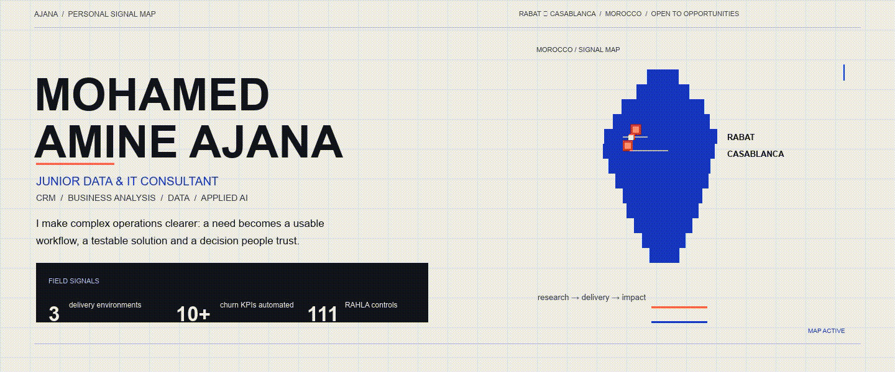

<!--
  github.com/iconamine
  A personal signal map, rather than a generic developer template.
  The hero is a real GIF so its motion remains reliable on GitHub.
-->

  

  <a href="mailto:ajanamine@gmail.com">Email</a>&nbsp;&nbsp;·&nbsp;&nbsp;
  <a href="https://www.linkedin.com/in/amine-ajana-3a78a0376/">LinkedIn</a>&nbsp;&nbsp;·&nbsp;&nbsp;
  <a href="https://github.com/iconamine?tab=repositories">All repositories</a>

## The person behind the signal

I am **Mohamed Amine Ajana**, a final-year Information Systems Engineering student at EMSI and a **Junior Data & IT Consultant**. I work in the space between a business team and the system it depends on: where a vague need has to become a clear requirement, a workflow, a test plan, a usable tool and, ultimately, a better decision.

My experience across Deloitte, VISEO and Banque Centrale Populaire has made that intersection concrete. I have worked on Salesforce delivery, CRM automation, UAT, data quality, churn analysis and operational reporting. The thread through all of it is simple: make work easier to understand, easier to verify and more useful for the people responsible for it.

<table>
  <tr>
    <td width="33%" valign="top">
      <strong>MAKE THE NEED LEGIBLE</strong>  
      Clarify what people need, write it precisely and make a delivery path everyone can follow.
    </td>
    <td width="33%" valign="top">
      <strong>MAKE THE SYSTEM USEFUL</strong>  
      Build CRM journeys, analytical tools and product workflows around the reality of the work.
    </td>
    <td width="33%" valign="top">
      <strong>MAKE THE OUTCOME PROVABLE</strong>  
      Define acceptance criteria, test the behaviour, follow defects and expose the signal behind a decision.
    </td>
  </tr>
</table>

## Field record

| Environment | Signal I brought to the work |
| :-- | :-- |
| **Deloitte · Salesforce Consulting** | Converted business needs into functional specifications, expected behaviours, acceptance criteria and UAT scenarios; followed anomalies through correction. |
| **VISEO · Salesforce Consulting** | Modelled two sales/support journeys, configured Flow Builder and Process Builder automation, built a Quote Composer LWC and controlled Salesforce imports/API exchanges. |
| **Banque Centrale Populaire · Data Analysis** | Defined and automated monitoring for 10+ churn KPIs; prepared datasets with Python, pandas and NumPy; built and evaluated an initial churn-prediction approach. |

## Tools are only useful in context

<table>
  <tr>
    <td width="50%" valign="top">
      <strong>DATA, ANALYTICS &amp; INTEGRATION</strong>  
      <code>Python</code> <code>SQL</code> <code>pandas</code> <code>NumPy</code> <code>scikit-learn</code> <code>REST APIs</code> <code>data quality</code>
    </td>
    <td width="50%" valign="top">
      <strong>CRM, DELIVERY &amp; QUALITY</strong>  
      <code>Salesforce</code> <code>Sales Cloud</code> <code>Service Cloud</code> <code>Flow Builder</code> <code>LWC</code> <code>UAT</code> <code>traceability</code>
    </td>
  </tr>
  <tr>
    <td valign="top">
      <strong>PRODUCT ENGINEERING</strong>  
      <code>Next.js</code> <code>TypeScript</code> <code>React</code> <code>Java / Java EE</code> <code>Docker</code>
    </td>
    <td valign="top">
      <strong>WORKING METHODS</strong>  
      <code>requirements</code> <code>specifications</code> <code>acceptance criteria</code> <code>defect tracking</code> <code>Agile / Scrum</code>
    </td>
  </tr>
</table>

## Selected work

### [RAHLA — Logistics Intelligence](https://github.com/iconamine/rahla-network-intelligence)

A multi-interface decision product for Morocco–Europe logistics corridors: an interactive network map, REST API and operational workflows. The repository documents **111 automated controls** across the product.

### [DataTrust 360](https://github.com/iconamine/datatrust-360)

An observable data-quality and transaction-risk platform built with event contracts, Redpanda/Kafka-compatible streaming, PostgreSQL, dbt, Airflow, FastAPI and Prometheus/Grafana. It is deliberately designed as a traceable system, not a dashboard with pretty charts.

### [AXIS Control Tower](https://github.com/iconamine/axis-crm-control-tower)

A workspace for CRM teams to connect incidents, functional requests, specifications, UAT evidence and release decisions into one controlled operating flow.

### Bilingual RAG Research Assistant

Academic retrieval assistant with source citations, evaluated on **100 documents, 1,950 pages and 150 questions**: **89.3% Precision@5**, **84.7% Recall@5** and **86.9% F1** in the project evaluation.

## Beyond the stack

I work in **French (DALF C1)**, **English (C1)**, **Arabic** and **German (Goethe B2)**. Outside systems and data, I make music — guitar, composition and performance — and enjoy voice work and visual creation. Those practices are part of how I think: pay attention, make the structure clear, then make it communicate.

I am open to junior opportunities in **Data**, **IT Consulting**, **Business Analysis**, **CRM/Salesforce**, **QA/UAT** and **digital transformation**, in Morocco and internationally.

All public portfolio work uses synthetic or non-confidential data.

