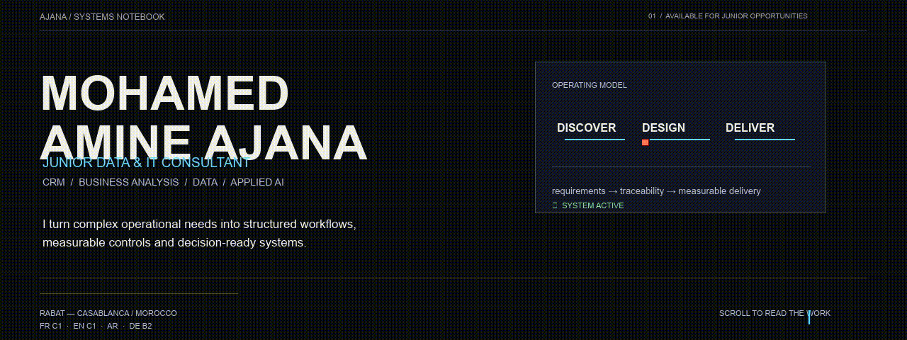

<!--
  github.com/iconamine
  The hero is a self-contained animated GIF for reliable GitHub playback.
  Its FFmpeg filter source is retained in assets/hero-filter.txt for maintainability.
-->

  

  <a href="mailto:ajanamine@gmail.com">Email</a>&nbsp;&nbsp;·&nbsp;&nbsp;
  <a href="https://www.linkedin.com/in/amine-ajana-3a78a0376/">LinkedIn</a>&nbsp;&nbsp;·&nbsp;&nbsp;
  <a href="https://github.com/iconamine?tab=repositories">Repositories</a>

## About me

I am **Mohamed Amine Ajana**, a final-year Information Systems Engineering student at EMSI and a **Junior Data & IT Consultant**. My work sits at the point where a business problem needs to become a dependable system: understanding the real need, structuring it into clear requirements, testing what is delivered, and making the outcome measurable.

Across Deloitte, VISEO and Banque Centrale Populaire, I have worked on CRM processes, Salesforce delivery, quality assurance, data analysis and operational reporting. I care about the connective tissue that makes a project usable in practice: precise specifications, acceptance criteria people can test, data that can be trusted, and decisions that are easy to explain.

<table>
  <tr>
    <td width="33%" valign="top">
      <strong>01 / FRAME</strong>  
      Turn ambiguous needs into user stories, specifications, acceptance criteria and a shared delivery path.
    </td>
    <td width="33%" valign="top">
      <strong>02 / BUILD</strong>  
      Design CRM journeys, automate repeatable work, analyse data and build practical tools around real workflows.
    </td>
    <td width="33%" valign="top">
      <strong>03 / PROVE</strong>  
      Validate with UAT, follow defects to closure and expose the measures needed for confident decisions.
    </td>
  </tr>
</table>

## Where I have contributed

| Environment | Contribution |
| :-- | :-- |
| **Deloitte — Junior Salesforce Consultant** | Translated business needs into functional specifications, acceptance criteria and UAT scenarios; supported traceable defect follow-up. |
| **VISEO — Salesforce Consultant** | Modelled sales and support journeys, configured CRM automation, developed a Lightning Web Component and prepared controlled data imports. |
| **Banque Centrale Populaire — Data Analyst** | Prepared and quality-checked analytical datasets, automated the monitoring of 10+ churn KPIs and built a first predictive baseline. |

## Working toolkit

<table>
  <tr>
    <td width="50%" valign="top">
      <strong>DATA &amp; ANALYTICS</strong>  
      <code>Python</code> <code>SQL</code> <code>pandas</code> <code>NumPy</code> <code>scikit-learn</code> <code>data quality</code>
    </td>
    <td width="50%" valign="top">
      <strong>CRM &amp; DELIVERY</strong>  
      <code>Salesforce</code> <code>Sales Cloud</code> <code>Service Cloud</code> <code>Flow Builder</code> <code>Data Loader</code> <code>LWC</code>
    </td>
  </tr>
  <tr>
    <td valign="top">
      <strong>ANALYSIS &amp; QUALITY</strong>  
      <code>requirements</code> <code>user stories</code> <code>UAT</code> <code>traceability</code> <code>defect tracking</code>
    </td>
    <td valign="top">
      <strong>ENGINEERING</strong>  
      <code>Java</code> <code>Java EE</code> <code>REST APIs</code> <code>Git/GitHub</code> <code>Docker</code> <code>Agile/Scrum</code>
    </td>
  </tr>
</table>

## Selected systems

### [DataTrust 360](https://github.com/iconamine/datatrust-360) — trusted data, not just dashboards

An observable, real-time data-quality and transaction-risk platform: event contracts, Redpanda/Kafka-compatible streaming, PostgreSQL and MinIO persistence, dbt transformations, Airflow orchestration, a FastAPI risk service and Prometheus/Grafana monitoring. The entire public project uses synthetic data.

### [AXIS Control Tower](https://github.com/iconamine/axis-crm-control-tower) — CRM operations made traceable

A product workspace that connects incidents, change requests, specifications, UAT evidence and release decisions. AXIS was designed around the operational reality of CRM Business Analysts, Product Owners, Support and QA teams.

### [Customer Churn Intelligence](https://github.com/iconamine/customer-churn-intelligence) — from data to a retention decision

An interpretable churn-risk workflow with data validation, leakage-safe modelling, evaluation, prioritised retention queues and an interactive simulator. It is packaged with automated tests, Docker and CI.

### [MIZAN](https://github.com/iconamine/mizan) — explainable transaction investigation

A live anomaly-investigation product that turns transaction signals into explainable risk scores, a prioritised review queue and downloadable evidence packages.

## A few things beyond the code

I work comfortably in international settings in **French (DALF C1)**, **English (C1)**, **Arabic**, and **German (Goethe B2)**. I am open to junior opportunities in data, IT consulting, business analysis, CRM/Salesforce, QA/UAT and digital transformation — in Morocco and internationally.

Every public portfolio project uses synthetic or non-confidential data.

